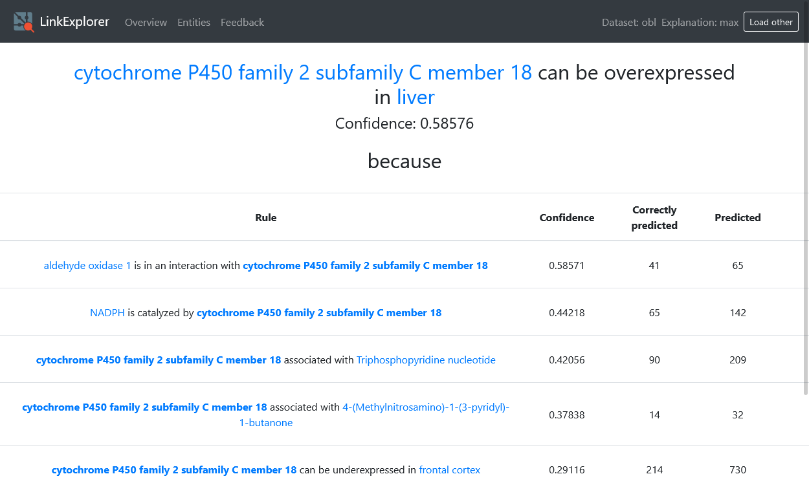

Explain
=======

Select prediction task
----------------------

.. image:: ../img/tuto12.png
   :class: with-shadow

View ranked predictions
-----------------------

... and their confidences. A checkmark means that this entity is in the test set (Note: this does not mean entities without a checkmark are false)

.. image:: ../img/tuto14.png
   :class: with-shadow

Explore rules that generated a prediction
-----------------------------------------

Explore instantiatons of rules with variables
---------------------------------------------

.. image:: ../img/tuto17.png
   :class: with-shadow

.. image:: ../img/tuto16.png
   :class: with-shadow